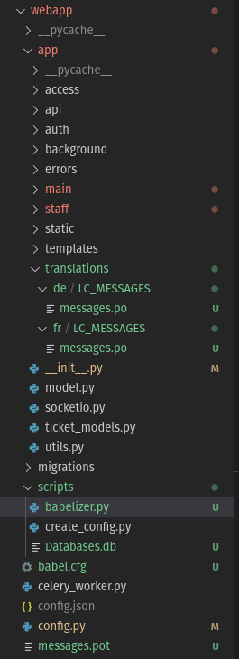
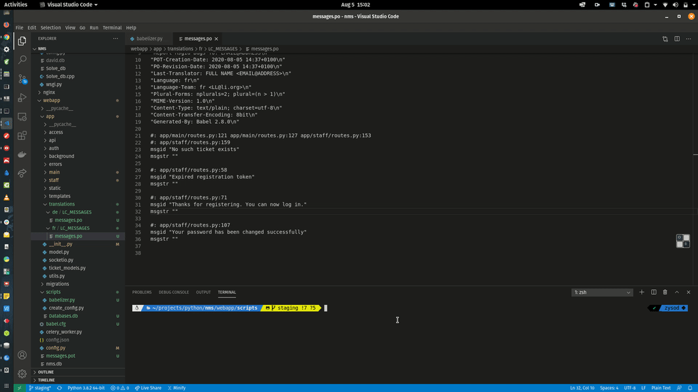

# babelizer
Automatically translate the contents of your Flask-Babel `.po` files. 

### Requirements
- Dryscrape (`pip3 install dryscrape`)

### Rationale
Having to manually translate the contents on the generated `messages.po` files is tedious. Wanted a way to automate the translation.
This script does this, leveraging on Google Translate.

### Usage
1. Install `dryscrape` as directed above.
2. Edit the `babelizer.py` script and point the `po_folder` to where the portable object (`.po`) files are located. Mine looks something like this, hence my `po_folder`: 

3. Simply run `python3 babelizer.py` and a new `.po` file (`t_messages.po`) will be generated in the same folder containing the translated text.

### Example
The below shows the generated `.po` files after conversion

### To-do
1. Use `argparse` to pass translations folder as argument. (Maybe???)

